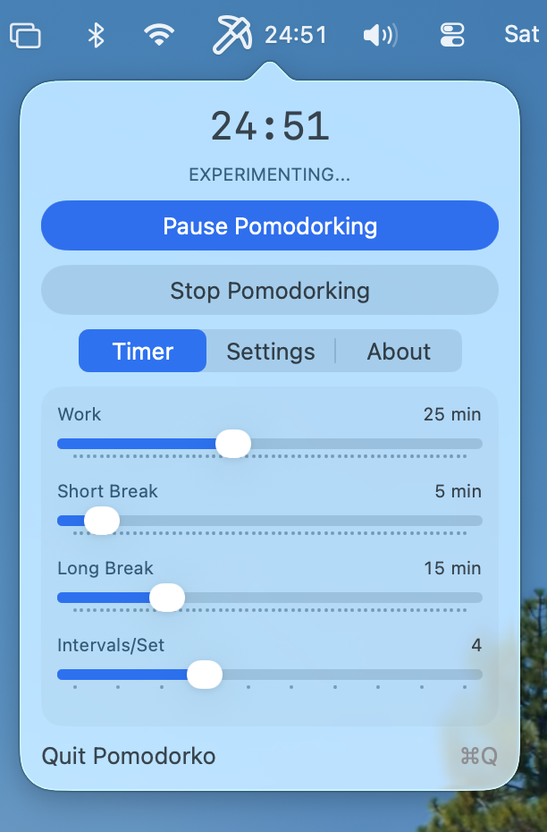

# Pomodorko

A quirky macOS menu bar pomodoro timer with the personality of a mad scientist chef.




## Features

- **Menu Bar Timer** - Lives in your menu bar with fun Lucide icons
  - Brain (idle)
  - Pickaxe (working)
  - Coffee (break time)
- **Pause & Resume** - Pause your timer anytime, skip to next phase, or reset
- **Slider Controls** - Set work intervals, short breaks, long breaks, and intervals per set
- **Distinct Sound Effects** - Different sounds for each transition (no distracting pop-ups)
  - Submarine ×2: Work complete
  - Funk: Full set complete
  - Blow: Break over
- **Global Hotkey** - Customizable keyboard shortcut to start/stop
- **Launch at Login** - Start automatically when you log in
- **CSV Logging** - Track your productivity in `~/Library/Caches/Pomodorko/pomodorko.log`
- **CLI Support** - Control via command line with distributed notifications

## Installation

### Build from Source

1. Clone the repository:
   ```bash
   git clone https://github.com/the-curated-brain/pomodorko.git
   cd pomodorko/Pomodorko
   ```

2. Open in Xcode:
   ```bash
   open Pomodorko.xcodeproj
   ```

3. Build and run (⌘R)

### Requirements

- macOS 13.0 (Ventura) or later
- Xcode 15.0 or later

## Usage

Click the brain icon in your menu bar to open Pomodorko.

### Controls
- **Start Pomodorking** - Begin a work session
- **Pause/Resume** - Freeze the timer and resume when ready
- **Stop Pomodorking** - End current phase and move to next (paused)
- **Reset Entire Session** - Go back to idle state

### Timer Tab
- Adjust work interval (1-60 min)
- Adjust short break (1-60 min)
- Adjust long break (1-60 min)
- Set intervals per set (1-10)

### Settings Tab
- Set a global hotkey
- Toggle "Stop after break"
- Toggle "Show timer in menu bar"
- Toggle "Launch at login"
- Adjust sound effect volume

### CLI

Control Pomodorko from the command line via distributed notifications:

```bash
pomodorko start    # Start the timer (if not already running)
pomodorko stop     # Skip to next phase (paused)
pomodorko pause    # Pause/resume the current timer
pomodorko reset    # Reset entire session back to idle
pomodorko status   # Print current timer status
pomodorko help     # Show help message

# Settings (values in minutes, except intervals which is a count):
pomodorko set work 25        # Set work interval (1-60 min)
pomodorko set short 5        # Set short break (1-60 min)
pomodorko set long 15        # Set long break (1-60 min)
pomodorko set intervals 4    # Set intervals per set (1-10)

# For scripting/automation:
pomodorko toggle   # Toggle on/off (for single-button bindings like Stream Deck)
```

## About

Built by TCB Media, LLC

Don't email me for tech support. Just fix it :)

## License

MIT License - see [LICENSE](LICENSE) for details.

This project uses [Lucide icons](https://lucide.dev) under the ISC License.

## Acknowledgments

Heavily inspired by [TomatoBar](https://github.com/ivoronin/TomatoBar) by Ilya Voronin.
